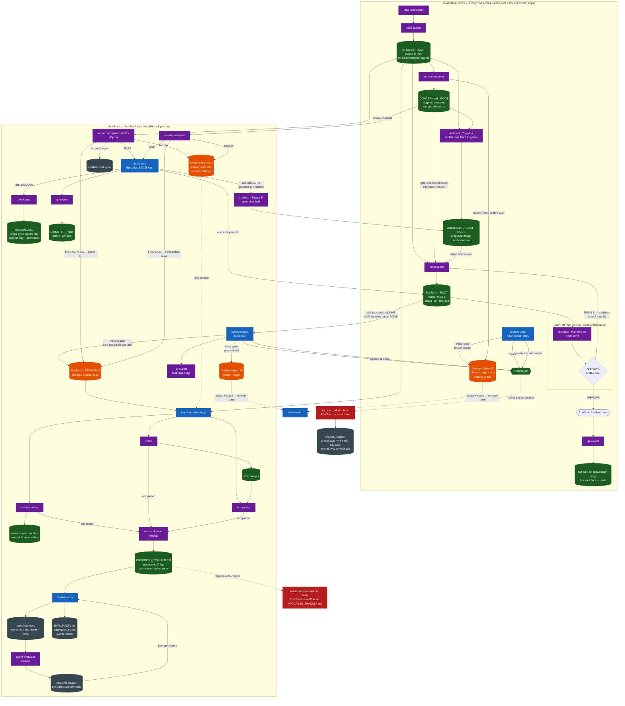
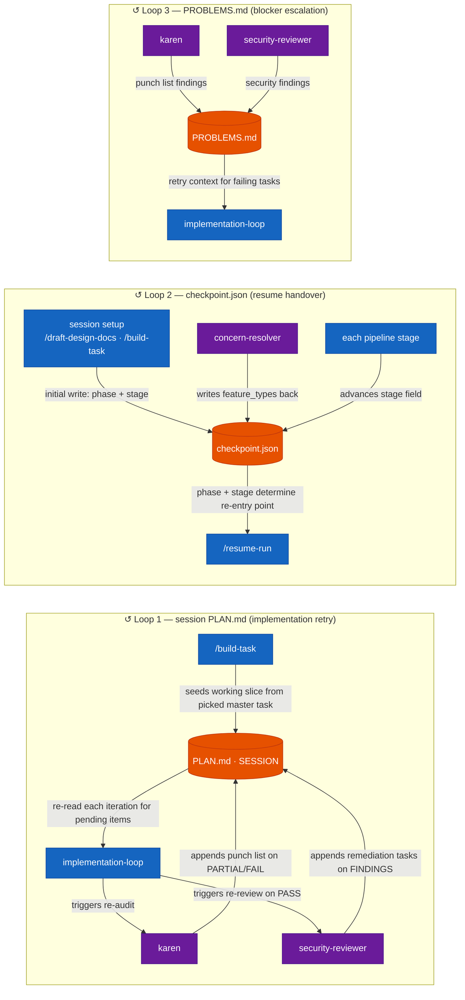

# EFF-IT Artifact Map

Companion to `docs/SDLC_FLOWCHART.md`. Focuses on **what is written, by whom, and who reads it** — rather than process flow.

**↺** marks artifacts that participate in feedback loops: a downstream agent writes back to them, and an upstream agent re-reads them in a later iteration.

> Render in any Mermaid-aware viewer (GitHub, VS Code + Mermaid Preview, mermaid.live).

The harness splits into two commands: **`/draft-design-docs`** writes the four durable repo-root docs (`SPEC.md`, `CONCERN.md`, `ARCHITECTURE.md`, `PLAN.md`) and opens a design PR, then stops; **`/build-task`** runs once per task, building it from the master root `PLAN.md` through a session-scoped working slice.

---

## Diagram 1 — Full Artifact Data Flow

---

## Diagram 2 — Feedback Loops (zoomed in)

Three artifacts form genuine feedback loops — downstream agents write back, upstream agents re-read in the next iteration.

---

## Reference Table

| Artifact | Path | Written by | Read by | Loop? |
|---|---|---|---|---|
| `.current_run` | `.current_run` | session setup (`/draft-design-docs`, `/build-task`) | `log_tool_call.sh` (routes log destination), `karen`, `security-reviewer`, `session-keeper` | No — cleared at `plan-ready` (design) / `done` (build) |
| `checkpoint.json` | `sessions/<run_id>/checkpoint.json` | session setup (initial, sets `phase`); every stage transition (stage field); `concern-resolver` (feature_types) | `/resume-run` (reads `phase` + `stage` for re-entry), `session-keeper` (seeds PROGRESS_TRACKER header) | **↺ Yes** — `concern-resolver` writes `feature_types` back; `/resume-run` reads `phase` + `stage` to re-enter |
| `SPEC.md` (root) | `SPEC.md` | `spec-drafter` | `concern-resolver`, `architect` (Trigger A), `orchestrator`, `implementation-loop`, `karen`, `security-reviewer`, `unit-test-writer` | No — durable/committed; write-once, read-many |
| `CONCERN.md` (root) | `CONCERN.md` | `concern-resolver` (from root SPEC.md) | `architect` (Trigger A), `orchestrator` (folds Architect Checklist into security tasks), `security-reviewer` (Review Checklist) | No — durable/committed; but `feature_types` extracted here are written back to `checkpoint.json` |
| `ARCHITECTURE.md` (root) | `ARCHITECTURE.md` | `architect` Trigger A (Architecture Draft, before orchestrator); `architect` Trigger B (appends as-built at finalization) | `orchestrator` (aligns task scopes); permanent design record for humans and future runs | No — single durable doc; Trigger A writes, Trigger B appends |
| `PLAN.md` (master, root) | `PLAN.md` | `orchestrator` (initial master tasklist, every task `status: TODO`, empty `pr:`, `finalized: false`); `/build-task` (flips `status: DONE` + `pr:` per task; sets `finalized`) | `/build-task` (picks buildable task: status≠DONE AND all `depends_on` DONE; seeds session slice) | No — durable/committed; one status/pr flip per task, not a tight loop |
| `PLAN.md` (session) | `sessions/<run_id>/PLAN.md` | `/build-task` (seeds working slice from picked master task); `karen` (punch list on PARTIAL/FAIL); `security-reviewer` (remediation tasks on FINDINGS) | `implementation-loop` (re-reads each iteration) | **↺ Yes** — per-task working slice; `karen` and `security-reviewer` append; `implementation-loop` re-reads |
| `docs/SPEC.md` | `docs/SPEC.md` | `spec-keeper` (at finalization, append-only, idempotent) | Human / future pipeline runs (cross-cycle feature log) | No — append-only; idempotent re-appends |
| `PROBLEMS.md` | `sessions/<run_id>/PROBLEMS.md` | `karen` (PARTIAL/FAIL); `security-reviewer` (FINDINGS) | `implementation-loop` (retry context) | **↺ Yes** — session-scoped, multi-writer, append-only; `implementation-loop` re-reads on next cycle |
| `PROGRESS_TRACKER.md` | `sessions/<run_id>/PROGRESS_TRACKER.md` | `session-keeper` (sole writer, append-only) | `evaluate-run` (extracts agent traces), `session-autocommit.sh` (triggers auto-commit on every write) | No — but auto-commit hook fires on every write |
| `session_log.json` | `sessions/<run_id>/session_log.json` | `log_tool_call.sh` hook (PostToolUse, when `.current_run` active) | Human / external tooling only | No |
| `tool-calls-YYYY-MM-DD.jsonl` | `sessions/tool-calls-YYYY-MM-DD.jsonl` | `log_tool_call.sh` hook (PostToolUse, when no active run) | Human / external tooling only | No — daily rotation |
| `audits/task-slug.md` | `sessions/<run_id>/audits/<task-slug>.md` | `karen` (when active run context exists) | Human review only | No |
| `traces/<agent>.md` | `sessions/<run_id>/traces/<agent_name>.md` | `evaluate-run` (extracts blocks from PROGRESS_TRACKER) | `agent-evaluator` | No — temp; left in place after run |
| `traces/<agent>.json` | `sessions/<run_id>/traces/<agent_name>.json` | `agent-evaluator` | `evaluate-run` (reads score + verdict to populate EVALUATION.md) | No — but part of a tight read-write loop within `evaluate-run` |
| `EVALUATION.md` | `sessions/<run_id>/EVALUATION.md` | `evaluate-run` | `/build-task` (appends one-line summary to PROGRESS_TRACKER) | No — idempotent; re-runs overwrite |

---

## Legend

| Color | Meaning |
|---|---|
| Dark green | Artifact (file written to disk) |
| Orange | Artifact in a feedback loop (written by downstream; re-read upstream) |
| Purple | Agent (spawned programmatically) |
| Blue | Command (user-invoked slash command) |
| Dark red | Hook (Claude Code lifecycle event) |
| Dark grey | Observability artifact (audit trail; not read by pipeline agents) |
