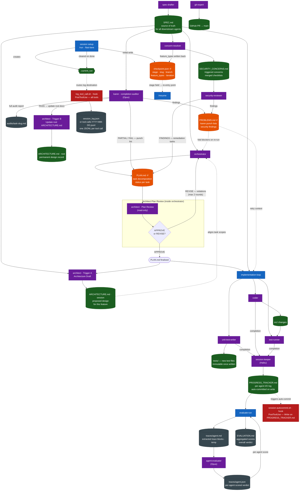
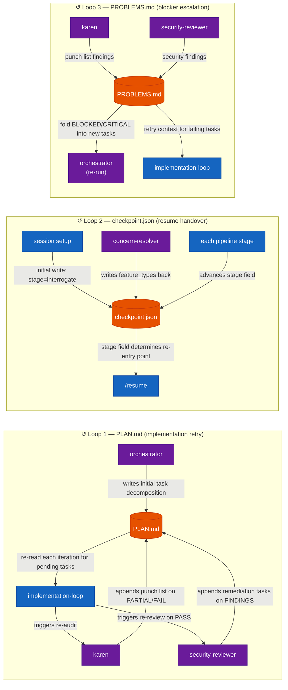

# EFF-IT Artifact Map

Companion to `docs/SDLC_FLOWCHART.md`. Focuses on **what is written, by whom, and who reads it** — rather than process flow.

**↺** marks artifacts that participate in feedback loops: a downstream agent writes back to them, and an upstream agent re-reads them in a later iteration.

> Render in any Mermaid-aware viewer (GitHub, VS Code + Mermaid Preview, mermaid.live).

---

## Diagram 1 — Full Artifact Data Flow

---

## Diagram 2 — Feedback Loops (zoomed in)

Three artifacts form genuine feedback loops — downstream agents write back, upstream agents re-read in the next iteration.

---

## Reference Table

| Artifact | Path | Written by | Read by | Loop? |
|---|---|---|---|---|
| `.current_run` | `.current_run` | session setup (`/run`, `/fast-lane`) | `log_tool_call.sh` (routes log destination), `karen`, `security-reviewer`, `session-keeper` | No — cleared at `stage: done` |
| `checkpoint.json` | `sessions/<run_id>/checkpoint.json` | session setup (initial); every stage transition (stage field); `concern-resolver` (feature_types) | `/resume` (re-entry point), `session-keeper` (seeds PROGRESS_TRACKER header) | **↺ Yes** — `concern-resolver` writes `feature_types` back; `/resume` reads `stage` to re-enter |
| `SPEC.md` | `sessions/<run_id>/SPEC.md` | `spec-drafter` | `orchestrator`, `concern-resolver`, `architect` (Trigger A), `implementation-loop`, `karen`, `unit-test-writer` | No — write-once, read-many |
| `PLAN.md` | `sessions/<run_id>/PLAN.md` | `orchestrator` (initial); `karen` (punch list); `security-reviewer` (remediation tasks) | `implementation-loop` (each iteration), `orchestrator` (on re-run, folds blockers) | **↺ Yes** — `karen` and `security-reviewer` append; `implementation-loop` re-reads |
| `ARCHITECTURE.md` (session) | `sessions/<run_id>/ARCHITECTURE.md` | `architect` Trigger A | `orchestrator` (aligns task scopes) | No |
| `ARCHITECTURE.md` (root) | `ARCHITECTURE.md` | `architect` Trigger B (post-karen PASS) | Permanent design record — human and future pipeline runs | No |
| `SECURITY_CONCERNS.md` | `sessions/<run_id>/SECURITY_CONCERNS.md` | `concern-resolver` | `security-reviewer` (mandatory Review Checklist) | No — but `feature_types` extracted here are written back to `checkpoint.json` |
| `PROBLEMS.md` | `sessions/<run_id>/PROBLEMS.md` | `karen` (PARTIAL/FAIL); `security-reviewer` (FINDINGS) | `orchestrator` (re-run: fold blockers), `implementation-loop` (retry context) | **↺ Yes** — multi-writer, append-only; upstream agents re-read on next cycle |
| `PROGRESS_TRACKER.md` | `sessions/<run_id>/PROGRESS_TRACKER.md` | `session-keeper` (sole writer, append-only) | `evaluate-run` (extracts agent traces), `session-autocommit.sh` (triggers auto-commit on every write) | No — but auto-commit hook fires on every write |
| `session_log.json` | `sessions/<run_id>/session_log.json` | `log_tool_call.sh` hook (PostToolUse, when `.current_run` active) | Human / external tooling only | No |
| `tool-calls-YYYY-MM-DD.jsonl` | `sessions/tool-calls-YYYY-MM-DD.jsonl` | `log_tool_call.sh` hook (PostToolUse, when no active run) | Human / external tooling only | No — daily rotation |
| `audits/task-slug.md` | `sessions/<run_id>/audits/<task-slug>.md` | `karen` (when active run context exists) | Human review only | No |
| `traces/<agent>.md` | `sessions/<run_id>/traces/<agent_name>.md` | `evaluate-run` (extracts blocks from PROGRESS_TRACKER) | `agent-evaluator` | No — temp; left in place after run |
| `traces/<agent>.json` | `sessions/<run_id>/traces/<agent_name>.json` | `agent-evaluator` | `evaluate-run` (reads score + verdict to populate EVALUATION.md) | No — but part of a tight read-write loop within `evaluate-run` |
| `EVALUATION.md` | `sessions/<run_id>/EVALUATION.md` | `evaluate-run` | `/run` (appends one-line summary to PROGRESS_TRACKER) | No — idempotent; re-runs overwrite |

---

## Legend

| Color | Meaning |
|---|---|
| Dark green | Artifact (file written to disk) |
| Orange | Artifact in a feedback loop (written by downstream; re-read upstream) |
| Purple | Agent (spawned programmatically) |
| Blue | Command (user-invoked slash command) |
| Dark red | Hook (Claude Code lifecycle event) |
| Dark grey | Observability artifact (audit trail; not read by pipeline agents) |
