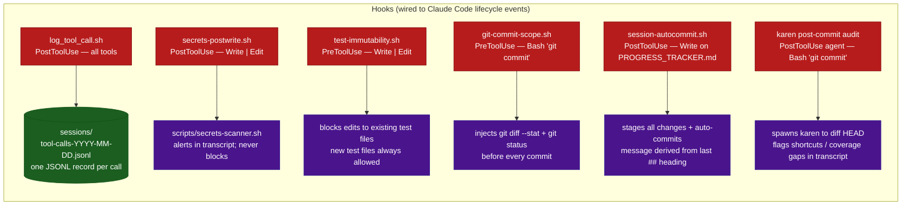

# EFF-IT SDLC Pipeline — Process Diagram

> Render this file in any Mermaid-aware viewer (GitHub, VS Code + Mermaid Preview, mermaid.live).

---

## Pipeline Flowchart

```mermaid
flowchart TD
    classDef cmd      fill:#1565C0,stroke:#0D47A1,color:#fff
    classDef agent    fill:#6A1B9A,stroke:#4A148C,color:#fff
    classDef artifact fill:#1B5E20,stroke:#145214,color:#fff
    classDef decision fill:#E65100,stroke:#BF360C,color:#fff
    classDef hook     fill:#B71C1C,stroke:#7F0000,color:#fff
    classDef stage    fill:#37474F,stroke:#263238,color:#fff

    %% ── Entry Points ──────────────────────────────────────────────────────────
    RUN["/run [idea]"]:::cmd
    FAST["/fast-lane [description]"]:::cmd
    RESUME["/resume [run_id]"]:::cmd

    %% ── Pre-flight ────────────────────────────────────────────────────────────
    RUN  --> PREFLIGHT{"clean main?"}:::decision
    FAST --> PREFLIGHT
    PREFLIGHT -- "No"  --> STOP["Stop — commit / stash first"]:::stage
    PREFLIGHT -- "Yes" --> SESSION_SETUP

    %% ── Session Setup ─────────────────────────────────────────────────────────
    SESSION_SETUP["Session Setup\nrun_id = YYYYMMDD-HHmm"]:::stage
    SESSION_SETUP --> CURR_RUN[(".current_run")]:::artifact
    SESSION_SETUP --> CHK[("checkpoint.json\nstage: interrogate")]:::artifact

    %% ── Interrogation Gate ────────────────────────────────────────────────────
    CHK --> GATE{"entry point?"}:::decision
    GATE -- "/run"       --> INTERROGATE["idea-interrogator\n(interactive)"]:::agent
    INTERROGATE          --> SPEC_AGENT["spec-drafter agent"]:::agent
    SPEC_AGENT           --> SPEC_MD

    GATE -- "/fast-lane" --> MINIMAL["write minimal SPEC.md\nfrom description"]:::stage
    MINIMAL              --> SPEC_MD

    SPEC_MD[("sessions/{run_id}/SPEC.md")]:::artifact

    %% ── Branch ────────────────────────────────────────────────────────────────
    SPEC_MD      --> GIT_BR["git-expert agent\ncreate feat/{slug}"]:::agent
    GIT_BR       --> BRANCH[("feat/{slug} branch\ncheckpoint: stage=branch")]:::artifact

    %% ── Orchestrate ───────────────────────────────────────────────────────────
    BRANCH       --> ORCH["orchestrator agent"]:::agent
    ORCH         --> PLAN[("sessions/{run_id}/PLAN.md\ncheckpoint: stage=concern")]:::artifact

    %% ── Security Concerns ─────────────────────────────────────────────────────
    PLAN         --> CONCERN["concern-resolver agent"]:::agent
    CONCERN      --> SEC_CONCERNS[("sessions/{run_id}/\nSECURITY_CONCERNS.md\ncheckpoint: stage=architect")]:::artifact

    %% ── Architecture Draft (run only) ─────────────────────────────────────────
    SEC_CONCERNS --> ARCH_Q{"arch draft?"}:::decision
    ARCH_Q -- "/run"       --> ARCH_A["architect agent\nTrigger A — Draft"]:::agent
    ARCH_A                 --> SESS_ARCH[("sessions/{run_id}/\nARCHITECTURE.md")]:::artifact
    ARCH_A                 --> PROG_INIT["init PROGRESS_TRACKER.md"]:::stage
    PROG_INIT              --> PROG_MD[("sessions/{run_id}/\nPROGRESS_TRACKER.md\ncheckpoint: stage=implement")]:::artifact
    SESS_ARCH              --> IMPL_ENTRY
    PROG_MD                --> IMPL_ENTRY
    ARCH_Q -- "/fast-lane" --> IMPL_ENTRY

    %% ── Implementation Loop ───────────────────────────────────────────────────
    IMPL_ENTRY(["↻  Implementation Loop  ↻\nmax 5 iterations"]):::stage

    subgraph IMPL ["  Implementation Loop (per task, per iteration)  "]
        direction TB
        UTW["unit-test-writer agent\n(Haiku / Sonnet / Opus advisor)"]:::agent
        UTW  --> T_FILES[("tests/ — new test files\n[immutable once written]")]:::artifact
        T_FILES --> CODER["coder agent\n(Sonnet)"]:::agent
        CODER   --> SRC[("src/ changes")]:::artifact
        SRC     --> TR["test-runner agent"]:::agent
        TR      --> TQ{"tests pass?"}:::decision
        TQ -- "FAIL\n(≤5 retries)" --> CODER
        TQ -- "PASS"               --> SK["session-keeper agent"]:::agent
        SK      --> PROG_ENTRY[("PROGRESS_TRACKER.md\nentry appended\n→ auto-committed by hook")]:::artifact
    end

    IMPL_ENTRY --> UTW
    PROG_ENTRY --> KAREN

    %% ── Completion Audit ──────────────────────────────────────────────────────
    KAREN["karen agent\n[completion auditor — Opus]"]:::agent
    KAREN --> KAREN_V{"verdict?"}:::decision
    KAREN_V -- "PARTIAL / FAIL" --> PROB_K[("PROBLEMS.md\npunch list appended to PLAN.md")]:::artifact
    PROB_K --> IMPL_ENTRY
    KAREN_V -- "PASS" --> EVAL

    %% ── Evaluate Run ──────────────────────────────────────────────────────────
    EVAL["evaluate-run\n(agent-evaluator per trace)"]:::stage
    EVAL --> EVAL_MD[("sessions/{run_id}/EVALUATION.md\nper-agent scores + overall verdict")]:::artifact

    %% ── Architect Update (run only) ───────────────────────────────────────────
    EVAL_MD --> ARCH_B_Q{"arch update?"}:::decision
    ARCH_B_Q -- "/run"       --> ARCH_B["architect agent\nTrigger B — Update root"]:::agent
    ARCH_B                   --> ROOT_ARCH[("ARCHITECTURE.md\n(repo root)")]:::artifact
    ROOT_ARCH                --> SECRV
    ARCH_B_Q -- "/fast-lane" --> SECRV

    %% ── Security Review ───────────────────────────────────────────────────────
    SECRV["security-reviewer agent\n(OWASP + SECURITY_CONCERNS checklist)"]:::agent
    SECRV --> SECV{"verdict?"}:::decision
    SECV -- "FINDINGS" --> PROB_S[("PROBLEMS.md\nfindings appended to PLAN.md")]:::artifact
    PROB_S --> IMPL_ENTRY
    SECV -- "PASS" --> GIT_WRAP

    %% ── Git Wrap-up ───────────────────────────────────────────────────────────
    GIT_WRAP["git-expert agent\ncommit → push → PR"]:::agent
    GIT_WRAP --> PR_OUT[("GitHub PR → main\nConventional Commit message")]:::artifact
    PR_OUT   --> DONE["stage: done\nrm .current_run"]:::stage

    %% ── Resume Entry ──────────────────────────────────────────────────────────
    RESUME   --> R_CHK[("sessions/{run_id}/checkpoint.json")]:::artifact
    R_CHK    --> R_AT["validate + restore context\nswitch to feat/{slug} branch"]:::stage
    R_AT -.->|"stage: orchestrate"| ORCH
    R_AT -.->|"stage: concern"    | CONCERN
    R_AT -.->|"stage: implement"  | IMPL_ENTRY
    R_AT -.->|"stage: audit"      | KAREN
    R_AT -.->|"stage: security"   | SECRV
    R_AT -.->|"stage: git"        | GIT_WRAP
```



---

## Hooks — Always Active



---

## Session Artifact Map

```
sessions/
└── {run_id}/                     ← e.g. 20260515-1430
    ├── checkpoint.json            ← pipeline stage + metadata (updated each step)
    ├── SPEC.md                    ← feature specification (source of truth)
    ├── PLAN.md                    ← task plan; punch lists appended on PARTIAL/FAIL
    ├── SECURITY_CONCERNS.md       ← triggered concerns + app-type checklists
    ├── ARCHITECTURE.md            ← proposed architecture for this feature (/run only)
    ├── PROGRESS_TRACKER.md        ← per-agent I/O log (auto-committed on write)
    ├── PROBLEMS.md                ← karen punch lists + security findings
    └── EVALUATION.md              ← agent-evaluator scores per trace

sessions/
├── tool-calls-YYYY-MM-DD.jsonl   ← global tool-call audit log (all runs)
└── .current_run                  ← active run_id (cleared on completion)
```

---

## Legend

| Color | Meaning |
|---|---|
| Blue | Command (user-invoked slash command) |
| Purple | Agent (spawned programmatically) |
| Green | Artifact (file written to disk) |
| Orange | Decision point |
| Dark red | Hook (Claude Code lifecycle event) |
| Dark grey | Pipeline stage / orchestration step |
| Dotted arrow | Resume re-entry path |
