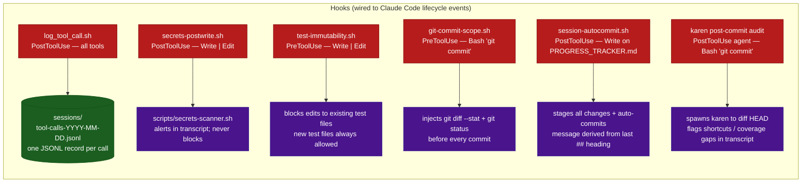

# EFF-IT SDLC Pipeline — Process Diagram

> Render this file in any Mermaid-aware viewer (GitHub, VS Code + Mermaid Preview, mermaid.live).

---

## Pipeline Flowchart

```mermaid
flowchart TD
    classDef cmd      fill:#1565C0,stroke:#0D47A1,color:#fff
    classDef agent    fill:#6A1B9A,stroke:#4A148C,color:#fff
    classDef artifact fill:#1B5E20,stroke:#145214,color:#fff
    classDef decision fill:#E65100,stroke:#BF360C,color:#fff
    classDef hook     fill:#B71C1C,stroke:#7F0000,color:#fff
    classDef stage    fill:#37474F,stroke:#263238,color:#fff

    %% ── Entry Points ──────────────────────────────────────────────────────────
    DESIGN["/draft-design-docs [idea]"]:::cmd
    FAST["/build-task [task]"]:::cmd
    RESUME["/resume-run [run_id]"]:::cmd

    %% ══════════════════════════════════════════════════════════════════════════
    %% DESIGN HALF — stays on main, produces root docs, opens design PR, stops
    %% ══════════════════════════════════════════════════════════════════════════
    subgraph DESIGN_HALF ["  /draft-design-docs — Design Half (on main → design PR)  "]
        direction TB

        D_PRE{"clean main?"}:::decision
        D_PRE -- "No"  --> D_STOP["Stop — commit / stash first"]:::stage
        D_PRE -- "Yes" --> D_SETUP["Session Setup\nphase: design\nstage: interrogate"]:::stage
        D_SETUP --> D_CHK[("sessions/{run_id}/checkpoint.json")]:::artifact

        D_CHK --> INTERROGATE["idea-interrogator\n(interactive)"]:::agent
        INTERROGATE --> IDEA[("IDEA_SUMMARY\nstage: spec")]:::artifact

        IDEA --> SPEC_AGENT["spec-drafter agent"]:::agent
        SPEC_AGENT --> SPEC_MD[("SPEC.md (repo root)\nstage: concern")]:::artifact

        SPEC_MD --> CONCERN_AGENT["concern-resolver agent\n(reads root SPEC.md)"]:::agent
        CONCERN_AGENT --> CONCERN_MD[("CONCERN.md (repo root)\nupdates feature_types\nstage: architect")]:::artifact

        CONCERN_MD --> ARCH_A["architect agent — Trigger A\n(reads SPEC.md + CONCERN.md,\nNO plan — runs BEFORE orchestrator)"]:::agent
        ARCH_A --> ARCH_MD[("ARCHITECTURE.md (repo root)\nstage: orchestrate")]:::artifact

        ARCH_MD --> ORCH["orchestrator agent\n(reads SPEC + CONCERN + ARCHITECTURE + BACKLOG;\nfolds Architect Checklist → security tasks;\nfolds OPEN backlog rows, carries rest forward)"]:::agent
        ORCH --> PLAN_MASTER[("PLAN.md (repo root) — master\nevery task status: TODO, pr: empty\nfinalized: false · stage: publish")]:::artifact

        PLAN_MASTER --> D_GIT["git-expert agent\nbranch docs/design-{slug}\ncommit 4 root docs · open design PR"]:::agent
        D_GIT --> D_DONE["stage: plan-ready\nrm .current_run\nSTOP — user reviews + merges PR"]:::stage
    end

    DESIGN --> D_PRE

    %% ══════════════════════════════════════════════════════════════════════════
    %% BUILD HALF — once per task, re-invoked for the next
    %% ══════════════════════════════════════════════════════════════════════════
    subgraph BUILD_HALF ["  /build-task — Build Half (once per task → atomic PR)  "]
        direction TB

        B_PRE{"clean main?"}:::decision
        B_PRE -- "No"  --> B_STOP["Stop — commit / stash first"]:::stage
        B_PRE -- "Yes" --> B_READ["read root PLAN.md"]:::stage
        B_READ --> B_PLANQ{"PLAN.md present?"}:::decision
        B_PLANQ -- "No" --> B_NOPLAN["Tell user to run /draft-design-docs"]:::stage
        B_PLANQ -- "Yes" --> B_SELECT["select BUILDABLE task\nstatus != DONE AND deps DONE\n+ OPEN BACKLOG rows\nask user · warn on blocked"]:::stage

        B_SELECT --> B_SETUP["Session Setup\nphase: build\nstage: task-select · task_id\ndetect test command"]:::stage
        B_SETUP --> B_CHK[("sessions/{run_id}/checkpoint.json")]:::artifact

        B_CHK --> B_GIT_BR["git-expert agent\nbranch feat/{task-slug} from main"]:::agent
        B_GIT_BR --> B_SLICE["write per-task working slice"]:::stage
        B_SLICE --> SLICE_MD[("sessions/{run_id}/PLAN.md\n(chosen task only — loop mutates THIS)\nstage: branch / implement")]:::artifact

        SLICE_MD --> IMPL_ENTRY(["↻  Implementation Loop  ↻\nPLAN_PATH = session slice\nSPEC_PATH = root SPEC.md\nmax 5 iterations"]):::stage

        subgraph IMPL ["  Implementation Loop (per iteration)  "]
            direction TB
            UTW["unit-test-writer agent"]:::agent
            UTW --> T_FILES[("tests/ — new test files\n[immutable once written]")]:::artifact
            T_FILES --> CODER["coder agent"]:::agent
            CODER --> SRC[("src/ changes")]:::artifact
            SRC --> TR["test-runner agent"]:::agent
            TR --> TQ{"tests pass?"}:::decision
            TQ -- "FAIL (≤5 retries)" --> CODER
            TQ -- "PASS" --> SK["session-keeper agent"]:::agent
            SK --> PROG_ENTRY[("PROGRESS_TRACKER.md\nentry appended → auto-committed")]:::artifact
        end

        IMPL_ENTRY --> UTW
        PROG_ENTRY --> KAREN

        KAREN["karen agent\n(audits vs root SPEC.md)"]:::agent
        KAREN --> KAREN_V{"verdict?"}:::decision
        KAREN_V -- "PARTIAL / FAIL" --> PROB_K[("punch list → session PLAN.md\n(loop back)")]:::artifact
        PROB_K --> IMPL_ENTRY
        KAREN_V -- "PASS" --> EVAL["evaluate-run\n(stage: security)"]:::stage

        EVAL --> EVAL_MD[("sessions/{run_id}/EVALUATION.md")]:::artifact
        EVAL_MD --> SECRV["security-reviewer agent\n(OWASP + root CONCERN.md checklist)"]:::agent
        SECRV --> SECV{"verdict?"}:::decision
        SECV -- "FINDINGS" --> PROB_S[("findings → session PLAN.md + PROBLEMS.md\n(loop back)")]:::artifact
        PROB_S --> IMPL_ENTRY
        SECV -- "PASS" --> FLIP["flip task status: DONE + pr:\nin master root PLAN.md\nstage: git"]:::stage

        FLIP -- "promote unresolved residue (OPEN);\nflip resolved → RESOLVED" --> BACKLOG[("BACKLOG.md (repo root)\ndurable problem backlog\ncreated lazily, carried across cycles")]:::artifact
        IMPL_ENTRY -. "ESCALATED (max iters):\ntask BLOCKED + triage PR" .-> BACKLOG

        FLIP --> FINAL_Q{"last task DONE\n& not finalized?"}:::decision
        FINAL_Q -- "Yes" --> FINAL["architect Trigger B → ARCHITECTURE.md (as-built)\nspec-keeper → docs/SPEC.md (cross-cycle log)\nset finalized: true"]:::agent
        FINAL --> B_GIT_WRAP
        FINAL_Q -- "No" --> B_GIT_WRAP

        B_GIT_WRAP["git-expert agent\ncommit task code + PLAN.md status\n(+ finalization) · push · one atomic PR"]:::agent
        B_GIT_WRAP --> B_PR[("GitHub PR → main")]:::artifact
        B_PR --> B_DONE["stage: done\nrm .current_run"]:::stage
    end

    FAST --> B_PRE

    %% ── Cross-cycle: open problems feed the next design ─────────────────────────
    BACKLOG -. "orchestrator folds OPEN rows\ninto the next plan (carry-forward)" .-> ORCH

    %% ── Resume Entry (dots into BOTH stage machines) ───────────────────────────
    RESUME --> R_CHK[("sessions/{run_id}/checkpoint.json")]:::artifact
    R_CHK --> R_PHASE{"phase?"}:::decision

    R_PHASE -. "design" .-> R_DESIGN["restore design context"]:::stage
    R_DESIGN -.->|"interrogate"| INTERROGATE
    R_DESIGN -.->|"spec"      | SPEC_AGENT
    R_DESIGN -.->|"concern"   | CONCERN_AGENT
    R_DESIGN -.->|"architect" | ARCH_A
    R_DESIGN -.->|"orchestrate"| ORCH
    R_DESIGN -.->|"publish"   | D_GIT

    R_PHASE -. "build" .-> R_BUILD["restore build context\nswitch to feat/{task-slug}"]:::stage
    R_BUILD -.->|"task-select"| B_SELECT
    R_BUILD -.->|"branch"     | B_GIT_BR
    R_BUILD -.->|"implement"  | IMPL_ENTRY
    R_BUILD -.->|"audit"      | KAREN
    R_BUILD -.->|"security"   | SECRV
    R_BUILD -.->|"git"        | B_GIT_WRAP
```



---

## Hooks — Always Active



---

## Session Artifact Map

```
Repo root (durable, committed — the design docs)
├── SPEC.md                        ← feature specification (source of truth)
├── CONCERN.md                     ← triggered concerns + app-type checklists
├── ARCHITECTURE.md                ← architecture (Trigger A draft → Trigger B as-built)
├── PLAN.md                        ← master tasklist (status / pr: / finalized: per task)
└── BACKLOG.md                     ← durable problem backlog (created lazily on first promotion)

docs/
└── SPEC.md                        ← cross-cycle spec log (spec-keeper, append-only)

sessions/
└── {run_id}/                      ← e.g. 20260515-1430 (ephemeral, local-only)
    ├── checkpoint.json            ← phase (design|build) + stage + metadata
    ├── PLAN.md                    ← per-task working slice (build loop mutates THIS)
    ├── PROGRESS_TRACKER.md        ← per-agent I/O log (auto-committed on write)
    ├── PROBLEMS.md                ← in-run findings scratch (table rows; promoted to BACKLOG.md)
    ├── EVALUATION.md              ← agent-evaluator scores per trace
    ├── traces/                    ← raw agent trace records
    └── session_log.json           ← structured session event log

sessions/
├── tool-calls-YYYY-MM-DD.jsonl    ← global tool-call audit log (all runs)
└── .current_run                   ← active run_id (cleared on completion)
```

---

## Legend

| Color | Meaning |
|---|---|
| Blue | Command (user-invoked slash command) |
| Purple | Agent (spawned programmatically) |
| Green | Artifact (file written to disk) |
| Orange | Decision point |
| Dark red | Hook (Claude Code lifecycle event) |
| Dark grey | Pipeline stage / orchestration step |
| Dotted arrow | Resume re-entry path |
